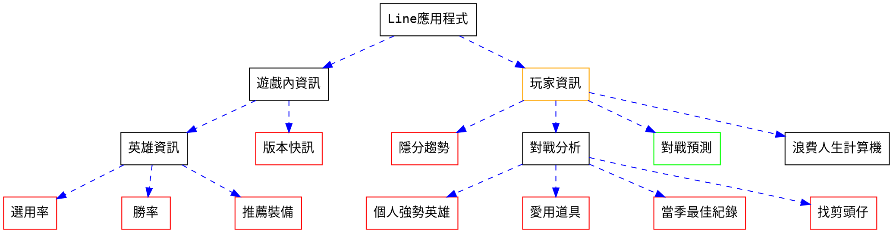

# ARAM勝率分析

[](https://hackmd.io/lTFPJuA6Rn-kpDqh8slQww)

## 使用說明
- **簡介**: 分析台灣玩家在當前版本的ARAM勝率，並且有ARAM推薦符文、推薦出裝、推薦技能次序、檢視玩家最近資訊等功能。

  -目前有新增一些關於NG、RANK等等的統計

- **指令**(越上方者優先判定): 


|指令|回傳文字|回傳圖片|
|-----|----|----|
|玩家 *<玩家名稱>*|遊戲地圖、模式、角色、KDA、最近平均勝率|無|
|玩家 *<玩家名稱>* 分析|更為深入的玩家數據轉換|無|
|玩家 *<玩家名稱>* 隱分|玩家在不同模式中的隱分|無|

## 主架構
* <font color="green">綠色</font>未完成 <font color="red">紅色</font>待修改 <font color="orange">橘色</font>重點項目

## 設計宗旨
* 減少使用者輸入頻率(EX:用按鈕顯示)  
* 增加常用指令速度(EX: 顯示常用指令)  
* 以**玩家為本體**設計 遊戲內資訊可以減少  

## APIs
### 基礎
- [X] 取得英雄名稱與id  
- [X] 取得商品名稱與id  
- [X] 取得召喚師技能名稱與id  
- [X] 遊戲版本取得  
- [X] LOL ID 取得  
- [X] 遊玩歷史紀錄取得  

### 進階
- [x] 玩家遊玩紀錄 
- [x] 個人強勢英雄計算與輸出 
- [x] 愛用道具計算與輸出
- [x] 當季最佳紀錄計算與輸出
- [ ] 隨機冷知識(?  你知道嗎?alankingdom在藍方的勝率更高!隱分和藍紅兩方的關係?
- [ ] pytesseract轉換圖像中文字 以利預測
- [ ] 機器學習勝率預測模型改良

## Line前端介面
- [ ] Button Message  

## Documentation
* 使用者資料表  
```sql
CREATE TABLE users(
    accountId TEXT UNIQUE,// LOL account id    
    LOLName TEXT NOT NULL UNIQUE
)
```
* 隱藏積分資料表  
```sql
CREATE TABLE elo(
    accountId TEXT PRIMARY KEY,
    gameMode TEXT NOT NULL, //哪種模式 ex: ARAM
    score INT NOT NULL, //隱分分數
    sqltime TIMESTAMP DEFAULT CURRENT_TIMESTAMP NOT NULL //更新的時間   
)
```
* 遊玩歷史紀錄資料表  
```sql
CREATE TABLE game(
    gameId INT,
    accountId INT FOREIGN KEY,
    gameMode TEXT NOT NULL, --ARAM/CLASSIC/ONEFORALL/URF/NEXUSBLITZ/KINGPORO/TUTORIAL_MODULE_1/TUTORIAL_MODULE_2
    gameType TEXT NOT NULL, --ex: "MATCHED_GAME"
    gameVersion TEXT NOT NULL,
    gameCreation DATETIME NOT NULL,
    gameDuration INT NOT NULL
    teamId INT NOT NULL, --100(blue) or 200(red)
    championId INT NOT NULL,
    win BOOL NOT NULL,
    items TEXT NOT NULL, --EX: " 1001 1002 1003 0 0 0 0 "
    kills INT NOT NULL,
    deaths INT NOT NULL,
    assists INT NOT NULL,
    largestKillingSpree INT NOT NULL,
    largestMultiKill INT NOT NULL,
    doubleKills INT NOT NULL,
    tripleKills INT NOT NULL,
    quadraKills INT NOT NULL,
    pentaKills INT NOT NULL,
    unrealKills INT NOT NULL,
    totalDamageDealt INT NOT NULL,
    totalHeal INT NOT NULL,
    totalDamageTaken INT NOT NULL,
    damageSelfMitigated INT NOT NULL,
    damageDealtToObjectives INT NOT NULL,
    timeCCingOthers INT NOT NULL,
    visionScore INT NOT NULL,
    goldEarned INT NOT NULL,
    totalMinionsKilled INT NOT NULL,
    buildingKills INT NOT NULL,
    champLevel INT NOT NULL,
    firstBloodKill BOOL NOT NULL,
    firstTowerKill BOOL NOT NULL,
    firstInhibitorKill BOOl NOT NULL,
    role TEXT, --DUO_SUPPORT/DUO/SOLO/DUO_CARRY/NONE
    lane TEXT, --MIDDLE/JUNGLE/TOP/BOTTOM/NONE
    PRIMARY KEY(gameId,accountId)
)
```
## 版本資訊   
* v2   
  - 2021.07.04.01  資料庫填充完成  
   
* v1  
  - 2020.08.07.24  注音近似  *ex: 口格摩會自動更正為寇格魔*  
  - 2020.08.08.01  圖片回傳版面更新  
  - 2020.08.08.02  更新提示字  
  - 2020.08.09.01  增加bp功能  
  - 2020.08.09.02  heroku config:add TZ="Asia/Taipei"  
  - 2020.08.10.01  APScheduler自動爬蟲  
  - 2020.08.15.01  加入隱藏積分  

