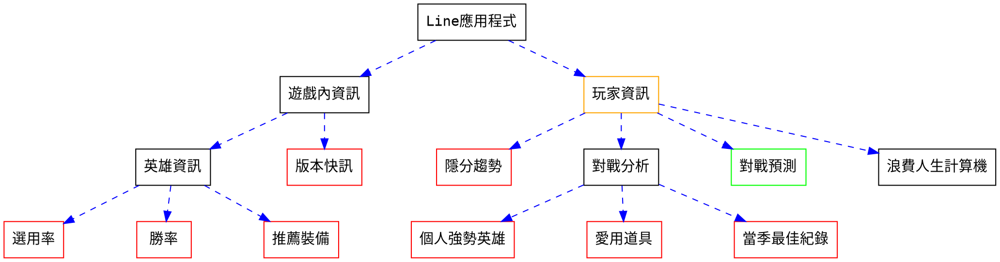

# ARAM勝率分析
- **簡介**: 分析台灣玩家在當前版本的ARAM勝率，並且有ARAM推薦符文、推薦出裝、推薦技能次序、檢視玩家最近資訊等功能。

  -目前有新增一些關於NG、RANK等等的統計

- **指令**(越上方者優先判定): 


|指令|回傳文字|回傳圖片|
|-----|----|----|
|玩家 *<玩家名稱>*|遊戲地圖、模式、角色、KDA、最近平均勝率|無|
|玩家 *<玩家名稱>* 分析|更為深入的玩家數據轉換|無|
|玩家 *<玩家名稱>* 隱分|玩家在不同模式中的隱分|無|
|勝率最低|最低勝率的5名角色|無|
|勝率最高|最高勝率的5名角色|無|
|aram說話  |(遇到無法辨識的指令自動提示)|無|
|aram閉嘴  |(關閉自動提示)|無|

## 主架構
* <font color="green">綠色</font>未完成 <font color="red">紅色</font>待修改 <font color="orange">橘色</font>重點項目

## 設計宗旨
* 減少使用者輸入頻率(EX:用按鈕顯示)  
* 增加常用指令速度(EX: 顯示常用指令)  
* 以**玩家為本體**設計 遊戲內資訊可以減少  

## APIs
### 基礎
- [X] 取得英雄名稱與id  
- [X] 取得商品名稱與id  
- [X] 取得召喚師技能名稱與id  
- [X] 遊戲版本取得  
- [X] LOL ID 取得  
- [X] 遊玩歷史紀錄取得  

### 進階
- [ ] 玩家遊玩紀錄 
- [ ] 個人強勢英雄計算與輸出 
- [ ] 愛用道具計算與輸出
- [ ] 當季最佳紀錄計算與輸出
- [ ] 隨機冷知識(?  你知道嗎?alankingdom的隱分昨天首度到達菁英

## Line前端介面
- [ ] Button Message  

## Documentation
* 使用者資料表  
```sql=
CREATE TABLE users(
    LineId TEXT PRIMARY KEY,
    LOLId TEXT UNIQUE,// LOL account id    
    LineName TEXT NOT NULL UNIQUE,
    LOLName TEXT NOT NULL UNIQUE
)
```
* 隱藏積分資料表  
```sql=
CREATE TABLE elo(
    accountId TEXT PRIMARY KEY,
    type TEXT NOT NULL, //哪種模式 ex: ARAM
    score INT NOT NULL, //隱分分數
    sqltime TIMESTAMP DEFAULT CURRENT_TIMESTAMP NOT NULL //更新的時間   
)
```
## 版本資訊   
  v2020.08.07.24  注音近似  *ex: 口格摩會自動更正為寇格魔*  
  v2020.08.08.01  圖片回傳版面更新  
  v2020.08.08.02  更新提示字  
  v2020.08.09.01  增加bp功能  
  v2020.08.09.02  heroku config:add TZ="Asia/Taipei"  
  v2020.08.10.01  APScheduler自動爬蟲  
  v2020.08.15.01  加入隱藏積分  